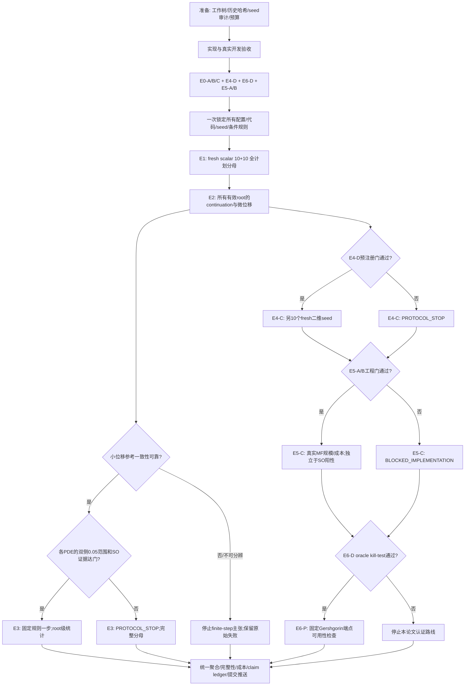

# SAEPS Phase 2 执行细则与自动决策树 v1.0

**本次交付状态：执行设计与决策逻辑已落地，尚未进行 Phase 2 数值实验。**

本文件把用户提供的 Phase 2 建议转化为有明确分母、输入、预算和终态的任务。它不是原 V5 或 Phase 1B 的修订结果，也不是“全部实验已经通过”的报告。用户要求本次先写仔细的执行细则；运行器实现和真实端到端验收完成之前，不得把本文的命令接口说成现成可运行的全实验程序。

规范包：`phase2_spec.json` 是数值默认值和节点清单；本文件解释数学、科学语义和实现要求；`revision_week/phase2/gates.py` 实现关键自动放行判据。`validate_plan.py` 检查机器配置的预算、分母、依赖和关联约束；它不能自动证明全部自然语言与未来实现语义相同，仍须逐条契约测试。发现冲突时必须阻止执行，不能挑宽松口径。配置现在属于 **PRE_EXECUTION_SPEC**；只有实现经过开发验收、seed 审计完整且生成执行锁后，才成为 **EXECUTABLE_LOCKED**。

“一次性自动执行”定义为：一次启动，所有节点按依赖自动运行或形成明确的跳过/阻塞终态，自动聚合、验证、提交和同步。它不意味着绕过科学停止门，也不意味着断电、文件缺失或资源不足时仍保证每条实验有数值。

## 1. 本轮要回答的问题和证据边界

| 问题 | 主要实验 | 允许结论 |
|---|---|---|
| SO 对 exact finite-gamma curvature 的改善能否独立复现？ | E1 | 两个固定 scalar benchmark 上的独立比较；不能直接等同 nonlinear profile |
| 失败是修正方向、幅度、状态响应还是阻尼敏感性？ | E0、E4-D | 事后机制分解；不训练事后成功分类器 |
| 连续局部分支能走多远？ | E2-A/B | 被追踪分支的离散、可能截尾的有效范围 |
| 曲率误差和有限位移误差如何分开？ | E2-C | 数值可分辨位移上的局部比较；不宣称有限网格证明极限 |
| SO 能否改善一步更新、二维几何及计算扩展性？ | E3、E4-C、E5 | 分开报告局部用途、矩阵准确性和计算可行性 |
| 对 defect energy 的求积估计是否有继续投入价值？ | E6-D/P | oracle feasibility 与可用谱端点分开；不把普通浮点包络称为严格证书 |

旧 V5 confirmation 对原 SAEPS-GN 仍保留原有证据身份和裁决。**仅对于新 SO 设计**，已经看过的旧中心属于 development/retrospective，不能倒改它们原来的历史标签。旧 V5 two-parameter 的 availability-limited 裁决、旧 profile 失败及 Phase 1B 重复恢复偏差永久保留。

## 2. 已核实的仓库资源与实现缺口

操作工作树：`C:/Users/RZF/Desktop/博士课题资料/SAEPS-so-week1`，分支 `codex/saeps-so-week1`。原 `SAEPS` 的未提交删除和新文件不归本任务处理。

| 资源 | 已定位路径 | 如何使用 |
|---|---|---|
| 旧 scalar 矩阵 | `revision_week/outputs/day1/raw/*.json` 指向 `outputs/posthoc/exact_fixed_state_v3/` | 全部历史位置保留，不能只装载有效记录；机器引用中的旧绝对路径通过仓库相对路径解析后核验内容哈希 |
| 完整二次型、Schur 参考和 defect | `revision_week/core.py` | 直接复用 `quadratic/evaluate/reference`，不另写简化标量公式替代生产路径 |
| 已恢复的真实状态 | `revision_week/outputs/day2/recovery/{burgers_55,burgers_59,burgers_67,allen_cahn_84}` | 通过 `p1b_correct.load_center` 重载张量、点和 truth；禁止调用退休的恢复 main |
| 最新一步代码与失败 | `revision_week/p1c_development.py` 及其输出目录 | E3 的候选规则来源；旧 Allen 失败不能覆盖 |
| noise/sparsity anchors | `outputs/runs/v4_8_robustness/noise_sparsity/seed_130..134/records/` | 已找到 14 条 exact 摘要，但摘要没有 theta/G/H 块；当前目录也未找到 pt/npz，不具备直接补算 SO 的充分输入 |
| 旧二维结果与状态 | `outputs/runs/v5/two_parameter/confirmation/seed_215..224/result.json`；`outputs/runs/v5/checkpoints/two_parameter_confirmation/seed_*/model_state.pt` | 已找到所有十个保存位置；按原 binding-valid 字段决定八个分析中心，另外两个保留不可用状态 |
| scalar 训练 | `src/saeps/scalar.py`，`src/saeps/p5_confirmation.py::_runtime_config` | 只复用底层训练与 residual，不调用会写旧 confirmation 目录的主程序 |
| 二维训练 | `src/saeps/multi.py`、`src/saeps/v5/two_parameter_development.py::_runtime` | 固定 width=6，不执行旧 cohort runner |
| MF 算子 | `src/saeps/autodiff.py::ResidualLinearization`、`src/saeps/core.py::MatrixFreeEliminator` | 复用 JVP/VJP/CG；实际算子计数从边界包装记录 |
| 规模基准 | `outputs/runs/v5/checkpoints/scalability_base/seed_120/`；`src/saeps/v5/residual_scalability.py` | 重载基准和实际 residual construction；历史 `_widen` 属于函数保持扩宽，必须标注 |
| 全仓库验收 | `scripts/validate_repository.py` | 只读核验，不借新实验更新旧 manifest |

新增实现仍包括：有明确停止原因的统一精化器、带分支核验的 continuation、FD 误差分辨率模块、scalar/multi 新 cohort 适配器、真正 MF SO 路径、Lanczos 求积、持久化调度与种子注册。已有局部代码不等于这些模块已经全部实现。

**E0-C 缺口的处理**：启动前扫描所有 worktree、refs/tags 可达历史、checkpoint manifest 和本地缓存。只有真实原状态或完整 G/H 块及其来源匹配才可计算。不从几个 Schur 标量反推 Hessian，不把同 seed 新训练称为旧状态。如果仍缺失，14 条均写 `execution=UNAVAILABLE`、`status=CHECKPOINT_INVALID`、`failure_reason=missing_original_state_or_full_blocks`。这不阻断独立 E1；但最终必须写“E0-C 未实际补算”，不能写“全实验数值齐全”。没有默认的新训练恢复预算。

## 3. 对原建议的明确裁决

1. 原文既说 E1“无论如何做”，又允许 Gate A 根据 SO 效果取消 E1。本细则固定为：**工程与资源前提通过后，E1 必须一次完成全部计划分母**；E0 阴性只影响主张范围，不用来逃避 fresh 阴性结果。
2. E4-D 提前并入开发收尾，避免 Gate A 等待未来节点造成循环。E6-D 的小矩阵 kill-test 也在开发收尾做；只有 E6-P 的实际谱界延伸留在最后。
3. E0-B 的 gamma sweep 是新开发敏感性分析，不改旧 nominal。E1/E2/E3/E4 的 nominal alpha 固定 `1e-8`，不按 sweep 中哪个 SO 最好而选择。
4. E2 跟踪的是固定 `J_gamma`；其 state Hessian 是 `A=H_theta_theta+gamma I`，不是遗漏锚定项的 `H_theta_theta`。同时保存两者，禁止混称。
5. E1 初次 fresh 训练前同时锁定 E2、E3、E4、E5、E6 的设计和条件分支；不能读到 E1 后再发明 locality 判据或新求解器。
6. E2/E3 复用 E1 roots，是**预注册的次级/条件分析**，不是第二批独立样本。E4-C 使用另十个从未使用的 seed。
7. E3 沿用 Phase 1C 的公共起点 `±0.05`，所以 Gate D 至少要求相应 PDE 的大部分 roots 双侧到达 `0.05`，不能以 `0.025` 放行。候选若超出已经核验的 branch 范围，直接保留不可行，不按该 root 的观测半径重新裁步。
8. `r_SPD` 和 `r_10%` 采用从中心连续通过的前缀及区间/截尾标志，不能取任意远处成功点的最大值，更不能把有限搜索上界写成真实 supremum。
9. 原文的“15/20”“每 PDE 至少 8/10”“90th percentile 不离谱”等建议，分别固定成下文明确数值。它们是本轮前瞻性设计选择，不是假称来自旧 locked protocol。
10. 局部 Hessian 椭圆只能叫局部曲率几何，不能在没有噪声/概率模型时称为不确定性或后验置信椭圆。

## 4. 调度总图



图表示数据依赖与门控，不表示多进程并发。默认顺序为开发收尾 → 全局锁 → E1 → E2 → E4-C → E5-C → E3 → E6-P → 收尾。某个子链科学失败，其他不依赖它的链继续。目标/算子存在实质实现错误则暂停所有共享该实现的节点，独立材料审计仍可完成。

## 5. 共同数学、单位和数值判据

### 5.1 固定对象

`ell(theta,lambda)=0.5*sum(r(theta,lambda)^2)`，r 已含冻结权重。训练代码可以使用 mean，但报告统一转成 sum；使用 mean 求解时锚定系数为 `gamma/m`，不能仍用 gamma。坐标为 scalar 的 log 物理参数，以及二维 `(log a,log b)`。

根中心生成后保存 `theta_c,lambda_c`。固定 `gamma=1e-8*lambda_max(J_theta^T J_theta at c)`；若谱尺度为零/非有限则该中心失败，不使用结果驱动下限替换。之后

`J_gamma(theta,lambda)=ell(theta,lambda)+gamma/2*||theta-theta_c||²`。

lambda 扰动、预测和corrector均不移动 anchor、不重算gamma、不对gamma求导。中心精化在 lambda 固定时优化未锚定 ell，完成后才定义 theta_c/gamma；禁止先定义锚点再精化后静默重置。

设 `G=J^T J`、`H=nabla² ell`、`A=Htt+gamma I`、`B=Htl`、`C=Hll`、`M=Gtt+gamma I`、`Z_G` 解 `MZ=Gtl`。计算：

```
F_RAW = Gll
F_GN  = Gll - Glt Z - Z^T Gtl + Z^T M Z
F_SO  = C - B^T Z - Z^T B + Z^T A Z
F_*   = C - B^T solve(A,B)
D     = B-AZ
F_SO-F_* = D^T solve(A,D)
```

所有方法共用实际计算出的同一 Z；GN residual 不为零时，不用 `Gll-Glt Z` 偷换完整二次型。F_* 在独立验证侧生成，不进入实用方法的选择和停止；E2 的 exact tangent predictor 属于 oracle branch diagnostic，须单独标注。

### 5.2 驻点与SPD

沿用 Phase 1C 的明确归一化：`g_norm=||grad_theta J_sum||/(m*max(||theta||,1))`。接受门固定 `1e-8`；开发精化内部目标 `1e-10`；精度审计内部目标 `1e-12`。同时报告绝对梯度、mean梯度及历史 residual-relative `S_theta`；不同归一化不能共享阈值名称。

小网络复用 `core.numerical_mu(A)` 的 symmetry/eigen-residual/orthogonality/roundoff margin。只有 `mu_value>0` 且相对对称误差≤`1e-8` 才标 `numerically_SPD`。`not_SPD` 与 `spd_unresolved` 分开。它是浮点数值检查，不是严格谱证书。E1/E4 的绑定条件是状态A有效，不把 F_* 正定强加到所有原本可定义的 stationary-state reduced Hessian；参数signature另报。

GN验证残差≤`1e-8`，求解目标`1e-10`；独立Schur求解残差≤`1e-10`；恒等式/operator归一化误差目标`1e-8`；MF与explicit curvature parity≤`1e-6`。分母过小的情形按下节处理，不用任意 epsilon 隐藏失败。

### 5.3 可分辨性与参考误差

scalar `S=max(1,|F_RAW|,|F_GN|,|F_SO|,|F_*|)`，matrix相应使用spectral norm。设置 `eps_F=1e-10*S`。参考通过两个独立数值路径（对称分解求解、Cholesky/残差修正求解）的差异、verified residual和roundoff尺度得到 `eta_F=max(eps_F,10*reference_disagreement)`；`eta_F>1e-6*S` 则 `reference_unresolved`。完整原始量和条件数必须保存。

若 `|F_*|<=eta_F`，归一化参考不可分辨：不生成伪造的logR，计为planned nonwin。若误差`e_G/e_SO<=eta_F`，记录区间/zero-error类别；绑定严格胜出要求 `|e_G|-|e_SO|>2*eta_F`。仅两项误差均可分辨时给标量logR。为使统计量对所有binding-valid pair定义完整，primary采用预先固定的 `logR_floor=log(max(|e_G|,eta_F)/max(|e_SO|,eta_F))`，同时给未经截尾且可分辨子集的logR。不能事后选择哪种汇总更好看。

这比原建议直接除以epsilon更明确；primary名称必须带`floor`。Invalid/tie仍计入planned nonwin，numeric bootstrap不填入伪造0或无穷值。

## 6. Seed registry 和全局执行锁

### 6.1 碰撞审计

在任何新训练前运行只读审计，范围包括：当前/其他worktree的已跟踪与未跟踪实验材料；`git rev-list --all` 可达历史、archive tags及本地reflog可达实验提交；所有JSON/YAML/TOML/CSV/MD/Python中的seed声明、run manifest、checkpoint metadata、目录中的seed编号。相同blob去重读取；大型二进制只读安全metadata和对应manifest。不能执行任意旧pickle代码或旧runner来获取seed。

每条保存 `seed, benchmark, purpose, evidence_path, evidence_commit/blob_sha, source_kind, used_or_reserved_or_ambiguous`。区分bootstrap/operator seed和训练seed，但本轮候选选择保守地排除全部发现的整数seed。无法解析的动态`range`/表达式记unresolved；尝试AST常量计算或读真实manifest，自行不能消解才阻止fresh lock。不能把“grep未找到”写成全局未使用证明。审计范围外/已删除不可达实验无法证明不存在，最终独立性声明限定为完整可访问仓库与材料。

候选搜索自 **1000** 起，按升序排除used、reserved、ambiguous集合，按固定块顺序分配：前10给Burgers，随后10给Allen–Cahn，再10给二维。三组数字不重叠，避免共享seed导致跨PDE统计相关。本文不预填实际seed。开发和算子随机数使用独立named stream并登记，不能侵占这30个预留训练seed。

实际seed值和审计JSON在执行锁时写定；E4即使不放行也保持reserved，不能用它们替换E1失败。重新启动首先核验registry哈希，不重新挑一批seed。

### 6.2 LOCK 内容

开发阶段只允许旧四个完整scalar状态、旧二维状态及synthetic测试；不能用fresh队列调求解器。冻结包必须包含：

- fully-resolved runtime YAML（含所有继承字段，而非只留相对引用）、训练/精化参数、所有门阈值、完整seed列表；
- E0/E4-D/E6-D后的角色与门决定；所有E2/E3/E4/E5/E6条件语句；
- 所有runner、底层residual、目标、solver、aggregate、tests的SHA256，Python/torch/numpy/BLAS版本和单线程设置；
- `source_commit`、Git tree id、协议正文和来源附件SHA256、数据/历史结果哈希；
- `execution_authorization`、预算、硬件、完整计划run清单及每条上游父ID。

先提交实现和协议，再生成指向该提交的LOCK_RECORD；提交并同步锁，然后才启训练。解决自引用：LOCK_RECORD引用前一个implementation commit，不试图把自己所在commit的SHA填入自己的内容。报告允许新提交，科学执行文件字节不得变。

跨E1/E4两个确认族采用固定顺序报告，E1为primary，E4为单独预注册secondary confirmation；不得把多个p值中最小者作为全项目主结论。bootstrap RNG stream和10000次重采样在锁中固定。

## 7. 新中心和profile求解器的执行规则

### 7.1 初始训练：一次且统一

- Burgers：`_runtime_config(configs/locked/scalar.yaml)` 的网络width16、数据/权重/优化器；只调用一次`train_scalar_checkpoint`，不启动旧P5 additional_training重试。
- Allen–Cahn：`configs/p4_screening.yaml` 的对应benchmark，width8；其他点/权重不动。一次训练。
- 二维：`configs/locked/multi.yaml` 展开为width6，其余物理参数/点/权重保留；一次`train_multi_checkpoint`。
- 上述optimizer既有Adam1600和LBFGS300属于一次固定pipeline，不解释为两个seed尝试。训练后lambda固定，记录未锚定状态精化前后的变化。新目标不是重复旧confirmation；新严格gate需独立验证。

### 7.2 新严格精化器：先实现，再以旧状态验收

不照抄Phase1C“接受目标下降后才发现非SPD”的逻辑作为branch corrector。统一候选实现如下，**不是根据fresh成功率选超参数**：

1. 根中心：未锚定mean ell，固定lambda；LBFGS `max_iter=1200,max_eval=2400,history_size=100,tol_grad=1e-12,tol_change=1e-18,strong_wolfe`。记录准确退出原因。profile corrector不用此长LBFGS，只用下述受限Newton/TR。
2. Newton/TR最多80次trial，初始relative trust radius0.01，最小`1e-8`，最大0.1；尺度`max(||theta_initial||,1)`固定。精确mean Hessian中direction shift `beta=max(0,1e-8*max(||H||2,1)-lambda_min(H))`；它只用于产生方向，不改目标H或科学gamma。
3. 对 `(H+beta I)d=-g` 的方向按radius裁剪。predicted reduction必须按未shift的原H计算，非正则拒绝并缩半。`rho>=0.1`且真实目标下降才接受；rho<0.25 radius缩半；rho>0.75且边界活跃则倍增，均受上下界限制。每trial计数；没有“隐藏重试”。
4. **branch模式额外要求trial的A通过SPD、predictor偏差≤0.01固定状态尺度，且梯度有限**；否则拒绝缩半，不跳到别的minimum、不做negative-direction escape、不多起点。根精化允许中间非SPD，但最终必须满足第5节，不加人为scientific damping救根。
5. 目标下降低于`64*eps64*max(1,|J|)`时只能用明确的roundoff分支：目标不能上升超过该floor，且梯度norm至少减半；保存启用标志，不能把这个floor当objective precision证明。
6. 内部stationarity目标`1e-10`；接受还需两次连续验证中的状态梯度≤`1e-8`、SPD、最后两个accepted改变量相对max(1,|J|)≤`1e-10`。用尽预算未满足即失败。精度审计目标`1e-12`，其失败不能冒充baseline失败或自动追加轮数。

开发验收必须覆盖Burgers/Allen两者、原来失去SPD的状态、具有多个minimum的synthetic toy。证明能正确拒绝/标记失效，不要求全部旧状态被“救活”。若实现持续与明确Hessian矛盾，不得锁fresh执行；这不是调参机会。

## 8. E0 — 历史开发收尾

### E0-A 统一失败机制

全部25条历史位置保留；21个可用矩阵重算 `e_G=Q_G-F_*`、`c=F_SO-Q_G`、`q=D^T A^-1 D`。验证 `e_SO=e_G+c=q` 和 `c*(2e_G+c)` 与严格改善判定一致。sign为零、乘积在数值分辨率内为零时单列tie/unresolved，不硬分三类。

分类：方向同号且可分辨→wrong_direction；异号且`|c|<2|e_G|`→appropriate；异号且`|c|>2|e_G|`→overshoot。Burgers59/67只是待核验标签，不写成预置结果。输出 `r_D,||Z||,cond(A),lambda_min(A),q,mu_effective`，最弱1个及最弱10%特征子空间的D能量占比；分开initial/terminal defect。不要把correction幅度与seed的因果机制混称。

交付 `MECHANISM.csv/json`、`FAILURE_MECHANISM.md` 和自动生成的有符号误差图；历史报告不变。

### E0-B gamma敏感性

每个同一旧中心固定r、G、H和theta/lambda，仅改变 `alpha=[1e-12,1e-10,1e-8,1e-6,1e-4,1e-2]`，gamma=alpha*原中心Gtt最大特征值。计划25×6=150条，预计可算21×6=126条；不满足A-SPD的cell保留不可用。完整二次型、exact、误差及可分辨性逐cell保存。

gamma不是新的global target selection。用每alpha planned/valid win rate、每PDE曲线、nominal和非nominal稳定性报告。若可用alpha少于3个，则稳定性unresolved；若nominal阳性但至少半数可用alpha的SO win rate≤0.5，标`damping_sensitive`。这是描述性flag，不阻止必须完成的E1，也不据此改alpha。

### E0-C robustness

计划为14个已有exact anchor位置，不能按SO表现改清单。只在全块/状态可用且摘要复现≤`1e-6`时补SO；不符合则明确unavailable。分别报告每个noise/sparsity cell、seed内配对和planned14分母；不把同seed多个condition视为独立seed。若可用≥8且SO胜出不超过一半，标`robustness_reversal`；可用<8标`robustness_unresolved`。两者均不改旧GN robustness裁决。

## 9. E1 — fresh scalar 独立确认

### 9.1 清单与执行

固定Burgers10和Allen10；运行顺序Burgers/Allen交错（第i个B、再第i个A）避免单一PDE用完总预算。每root一次完整pipeline：train→固定lambda严格状态精化→冻结theta_c/gamma→保存全输入→独立梯度/A-SPD→GN/full SO/exact→精度与公式核验→manifest。失败在当时封存，不重训、不替换、不多给个别seed时间。

仅参数梯度不为零不是失败，因为研究固定lambda的state elimination；state gradient必须达标。truth-dependent参数误差仅validation_only。每条初始/最终gradient、theta变化、loss、iteration、function evaluation、eigenmargin、termination、全部G/H块、参数/残差权重、RNG/optimizer状态、点和truth必须可重载。

### 9.2 Primary gate B

同时满足才给E1 `SUPPORTED`：

- planned strict wins≥15/20；
- 每PDE binding-valid≥8/10；
- 每PDE wins>valid/2（tie/invalid不能产生majority）；
- valid-pair median logR_floor>0。

若未满足且valid足够、总体wins≤valid/2，`NOT_SUPPORTED`；其他`PARTIALLY_SUPPORTED`并给`availability_limited`或`benchmark_dependent`原因。不足valid不是暗示阴性数学结论。所有工程成功执行仍可标PASSED。

报告原始绝对/相对误差、完整planned分母、每PDE和pool的root-level分布。分层paired percentile bootstrap：分别在每PDE有效roots内有放回抽取相同数量，合并计算median，10000次，95%区间；CI不新增事后放行条件。sign test给valid非tie样本的条件描述，另外给planned胜出比例；不能把invalid=nonwin的20次机械解释成同分布coin-flip推断。

SO主张能否进主文还受目标一致性、独立性和适用范围限制；Gate B是证据门，不是自动生成“普遍SO更优”的许可。

## 10. E2 — continuation、branch range 和微位移

### 10.1 E2-A 轨迹

E1所有binding-valid roots进入，不按SO是否胜出筛选。正负两侧从同一根独立出发；全程fixed anchor/gamma。predictor使用当前点exact tangent `Z_*=A^-1 B`：`theta_pred=theta-Z_*h`，清楚标为oracle-assisted geometry diagnostic，其成本不混入SO生产开销。

常规grid从0到±0.075，每步0.005。失败后从**上一个accepted状态**重试h/2，再h/4，最小0.00125；这些trial都写记录。成功后保持当前较小步长，不再扩步。为精确到达目标grid允许最后一个remainder小于min step，但它不是一次可继续缩小的自由调参机会。每侧最多60个accepted步、180个forward trial，超出即budget_exhausted。

每accepted点保存state、J、g、A谱界、未加gamma的Htt谱、||A^-1B||、预测误差、相对根位移。再作一次固定反向predictor/corrector回到前一点，比较normalized state difference≤`1e-5`及objective误差估计；失败标`branch_consistency_unresolved`。反向解只作验证，不取代forward状态。每侧反向校验最多60次。

### 10.2 E2-B 范围与终止分类

每侧记录 `[last_valid_delta,first_failed_trial_delta]`及失败细步位置，而不是唯一真实半径。三种边界分开：

- `observed_nonSPD_state`：最后trial的numerical A明确有负特征值；只能说观察到该trial失去SPD，**还不能证明连续minimum branch不存在**。
- `stability_boundary_evidence`：最后三个accepted点的min eigen单调下降，末值≤初值0.1，随后相邻最小步trial明确nonSPD且reverse一致性此前通过。可说“证据与被追踪分支的局部稳定边界一致”，仍非严格分岔证明。
- `solver_limited / branch_unresolved / resolution_limited / budget_exhausted`：不画成SPD collapse；不把最后valid点当真实边界。

到达0.075仍valid标`right_censored_at_max_offset`。输出双侧范围及保守双侧min；每个delta给：planned10的observed-valid比例、E1有效roots条件比例、failed/unknown/censored数量。不要把未知点硬编码为物理失效。

### 10.3 E2-C 微位移独立目标点

delta固定`[1e-4,2e-4,5e-4,1e-3,2e-3,5e-3,1e-2,2e-2,5e-2]`。每个±delta从根沿同一规则追踪到准确坐标，最大步0.005，不从一个更远点倒走，也不把baseline轨迹插值当真实解；允许重用完全相同目标、同路径规则且哈希一致的已保存状态。每个目标最多60个accepted点/240个总corrector尝试，单目标60s；总E2预算仍优先。

精度audit：每个可达端点和根从其保存state做一次更严格corrector（目标`1e-12`、上限80trial），**验证副本不改变anchor、不覆盖baseline**。baseline与audit必须通过SPD、梯度和局部state一致性；否则该FD点标unresolved。误差估计

`eta_phi = 10*|J_audit-J_base| + 10*0.5*g_audit^T A_audit^-1 g_audit + 64*eps64*max(1,|J_audit|)`。

它是局部数值诊断，不是全局优化误差上界。使用audit目标计算K_FD，并保存baseline版本。`eta_K=(eta_phi_plus+2*eta_phi_zero+eta_phi_minus)/delta²`，加上三项求和roundoff项除delta²。只有双侧branch有效且`eta_K<=0.01*max(|F_*|,eps_F)`且`|K_FD|>10*eta_K`才称FD resolved。

### 10.4 Gate C 与 locality radius

从锁定小位移集合`delta<=0.005`按delta升序取**最小三个resolved点**（不按谁最贴近exact挑点）。不足三个→`resolution_limited`。各点`|K-F_*|/max(|F_*|,eps_F)<=0.05`，且最小两个相互差异≤`0.05*max(|F_*|,eps_F)`，才称`local_reference_consistent`。没有通过不直接证明exact错误：另分`resolved_reference_mismatch`与profile/branch/precision failure。遇到明确实现不一致才进入修复；本轮确认数据不可用于调阈值或换solver。

`r_10%^(M)`在所有resolved且branch有效delta上计算；从最小resolved delta开始取连续全部满足 `|F_M-K|/|K|<=0.1` 的前缀。中间unresolved则半径截尾，后面的偶然通过不能重启前缀。第一个点就失败记`below_min_resolved_delta`，无resolved点为null，不能写0。最大grid通过为右截尾，不声明继续有效。

输出分解 `curvature_approximation_error=|F_M-F_*|`、`finite_displacement_difference=|F_*-K|`、`eta_K`三条，不把三角不等式写成误差精确可加。图：branch survival、eigen轨迹、K(delta)与各曲率、两类误差及数值floor、各方法radius区间。

## 11. E3 — 受条件约束的一步次级试验

每个PDE单独放行，条件同时是：E1该PDEvalid≥8、wins≥6且median logR_floor>0；E2中该PDE≥8个roots具备双侧连续到0.05、reverse通过且Gate C通过。一个PDE失败不删除其planned10 roots，它们生成 `PROTOCOL_STOP`。另一PDE符合则可继续。

运行后不能再称E3是independent confirmation；它是从E1/E2可用性选择出的条件分析。所有20 roots×2 offsets×4 methods=160计划位置保留，最多160个新candidate solve。两个方向共用root不能算独立样本。

严格继承Phase1C：起点±0.05；beta=`1e-6*max(F_RAW,1e-8)`；raw step=`-g_lambda/(F_method+beta)`；step=`clip(0.1*raw,-0.1,0.1)`；候选初始化=`theta_s-Z_G*step`；一候选/方法，无第二个coef救援；Armijo=`1e-4`。这几个规则不根据E1/E2改。

如果某候选总坐标不在该root相应方向**已经核验的连续branch范围**内，直接记录`outside_observed_branch_domain`，不把半径改为那个root的观测值。有范围覆盖也仍须自己过candidate gate，不能把E2成功替代实际求解。

候选求解仍用Phase1C `LBFGS300 + 最多8步Newton/12次回溯` 的已冻结过程以保持比较；若其trial失去SPD则fail-soft。不得偷偷换成E2更强solver再声称复现Phase1C。完整保存solver字节hash，objective统一fixed root anchor。对于初始状态、candidate和precision-audit均保存张量。

接受要求：candidate gradient≤`1e-8`、A-SPD、局部branch一致性通过、predicted>0且`actual-1e-4*predicted`大于起点+候选的数值误差估计。precision-audit使用E2副本规则，计入候选300s上限。rho在predicted不可分辨时为null。

每root只有两侧SO/GN均可用才能计算完整paired `Delta_bar`；缺一侧不能用另一侧替代平均。报告conditional有效root paired distribution和planned20 root中完整SO胜出率；bootstrap按root且按PDE分层。synthetic physical parameter absolute/relative error分开，不输入接受门。没有参数truth也不影响部署指标。

## 12. E4 — 二维开发和独立确认

### E4-D

全部旧planned10条留表；从原binding-valid字段取八个可比状态，**不新增训练或精化后冒充原状态**。重载points、coordinate和runtime，用当前目标复现旧Fraw/GN/exact；不能仅因为同seed就认定重现。旧数据上的矩阵比较允许使用其原历史状态有效性，严格新gate另报，不能回改旧8/10。

full 2×2 F使用第5节。指标：Frobenius/spectral相对误差、带符号特征值误差、最小特征值、signature、条件数（F不SPD则不叫SPD condition）、坐标耦合。reference eigengap≤`1e-6*max(||F_*||2,eps_F)`则单根特征向量方向不可识别，角度写null，另报投影子空间误差。可识别时角度=`acos(clip(abs(v^T v_*),0,1))`；不混淆符号，不做跨seed方向拼接。

Gate E：八个原valid状态全部重载一致，至少6/8在Frobenius和spectral误差上均严格改善，median两种logR_floor均>0。任一实现一致性失败则工程门失败；收益不足仅停止E4-C。primary仍以预注册log坐标的Frobenius比较，谱误差为强制并列稳定性描述；whitened指标若展示只能secondary，不临时替换primary。

### E4-C

使用预留的另十个fresh seeds。一次width6训练与第7节严格state精化，full matrix、两列Z和两方向HVP均保存。binding门：same-objective/strict state/A-SPD/GN/reference全部通过。primary `SUPPORTED`要求valid≥9/10、planned Frobenius wins≥8/10、median logR_floor>0、valid非tie exact sign p≤0.05；spectral majority不得反转（wins>valid/2）。不足则按明确原因给PARTIALLY_SUPPORTED或NOT_SUPPORTED，不补两个失败seed。

E4-C不能“修复旧V5 INCONCLUSIVE”。二维weak-direction准确性不等于global identifiability、posterior covariance或实际joint inversion收益。

## 13. E5 — 真正matrix-free SO

### E5-A 小网络随机方向

四个已恢复scalar中心，每个5个固定named-stream标准正态单位joint方向，加实际[-Z;1]方向；共24个direction位置。真实AD HVP与independent explicit H@v，JVP/VJP adjoint和full quadratic identity逐条检验；gate采用第5节。不仅检查一个特殊响应方向。旧HVP结果可作回归，不替代新方向记录。

### E5-B 完整MF链

每个compact中心MF worker仅接收state/data/runtime/gamma，不接收G/H/Z/explicit对角预条件器。用JVP/VJP实现 `(Jt^T Jt+gamma I)v`，零初值CG（无预条件，tol1e-10，max500，verified residual1e-8）；参数列用 `jvp_lambda(e_j)` 而非`jacrev`。`F_SO=V^T HVP(V)+gamma Z^T Z`，p列各一HVP。full quadratic无需完整矩阵。

MF与explicit必须在两个进程中：前者运行时禁用`jacrev/jacfwd/hessian/explicit_jacobians`入口，trace实际调用计数，不只手写metadata=0。后者只在验证sidecar构造参考。比较p×p曲率≤1e-6，同时保存绝对差、尺度和GN residual。允许p×p小矩阵，禁止n×n state矩阵与m×n Jacobian。MF失败不能自动加载dense Z继续假装MF。

### E5-C 规模与成本

仅E5-A/B工程门通过才能运行；**不要求SO科学效果为阳性**，因为成本问题独立。固定`n=[1001,10001,100001]`、实际residual `m=[213,853,3413]`，共9个cell；重用现有`seed120`、实际网格与函数保持扩宽。每cell一次冷启动、一次单独预热、三次稳态；每次GN都零初值。全部45次pass均计费，不把冷启动/预热删账。

按现有scale协议 `gamma_alpha=1e-2`、20步power iteration，power vector使用固定named stream；condition的gamma只在setup算一次，报告power估计而非exact谱。此gamma与scalar1e-8不同，明确这是既有cost-only条件，不借它论证科学精度。

分别记录load/setup/power、GN、SO增量、total；所有JVP/VJP/HVP/A-matvec；进程RSS峰值（psutil parent 20ms采样并标sampled peak）及可获得的OS peak working set，两者不得称精确tensor peak。采样和同步成本计入wall。CPU单线程；不能默认GPU可用。

没有exact reference的100k网络不写accuracy；函数保持扩宽也不等于从头训练的100k网络。单个cell超时/OOM保留，其余按预定顺序继续，不能缩width后把替代cell填回同一格。输出成本—尺寸表，不拟合未经设计支持的复杂度指数。

## 14. E6 — inverse-quadratic-form kill-test

### E6-D 固定oracle可行性

全部25位置，21个可用矩阵；对**原GN响应处的initial D**和**原SO-ADAPT固定终点的terminal D**分别分析，terminal是primary，initial为secondary，禁止混用。每个D只运行一条最多16步Lanczos轨迹，在k=`2,4,8,16`处读出；不是四次独立run。full reorthogonalization两遍，记录orthogonality/residual与额外cost。

采用Gauss下估计及left Gauss–Radau上估计对 `q=D^T A^-1 D` 建区间；oracle端点用数值eigensolve和margin得到的 `a=lambda_min-margin>0`。不能把Ritz最小值当有保证下界。算法依据见 [Li、Sra、Jegelka，ICML 2016](https://proceedings.mlr.press/v48/lig16.pdf)：Gauss类求积可用于SPD矩阵inverse forms的上下界；本任务的浮点实现仍只称numerical interval。

实现约定：v1=D/||D||；k步得到Tk及尾系数beta_k；`L=||D||² e1^T Tk^-1 e1`。构造附加对角 `alpha_R=a+beta_k² e_k^T(Tk-aI)^-1 e_k` 的(k+1)阶tridiagonal作为left-Radau矩阵求U。所有小线性系统用solve，禁止显式inverse；测试需验证端点合法和上下包络方向。breakdown时只有verified Lanczos residual及不变子空间检查通过，才标exact termination；否则unresolved。D数值为零时q=0单列，不用0/0 effectivity。

必须有已知对角谱、双峰病态谱、D避开最弱方向、D沿单特征方向、near-breakdown的单元测试。小系统shift接近奇异时保留unresolved；禁止事后调endpoint取得更好包络。

Gate F固定在 **k=8** 的terminal D（更早成功可展示，但不用于挑k）：全部21 numerical coverage；median U/q≤3；q90 U/q≤10；全部可分辨q的upper/lower有限。未满足则停止本论文认证路线；k16仅展示预先计划的成本曲线，不能用它翻转GO。coverage按`L-eta_q<=q<=U+eta_q`及gap/resolution报告。独立reference侧固定 `eta_q=max(100*eps64*||D||²/mu,10*|q_cholesky-q_symmetric_solve|)`；非零q若eta_q>0.01*q则unresolved并阻止GO，不能用大容差掩盖错误包络。oracle q及eta_q只在求积轨迹封存后计算，不反馈到Lanczos步数。

### E6-P 自动可执行的有限延伸

原建议“通过后再研究practical spectral bounds”不具备一次性可执行定义。本细则将它收窄为一个固定检查：同21 matrices计算Gershgorin下界 `a_G=min_i(Aii-sum_{j!=i}|Aij|)-roundoff_margin`。若a_G>0，用同8步轨迹计算Radau；若≤0则记录`practical_endpoint_unavailable`，不调用oracle替代。dense读取全部A本身需计O(n²)成本，不能称MF谱界。

要求endpoint availability≥18/21、所有可用endpoint上的coverage通过，并在这些可用记录上满足同样median/q90 effectivity门，才标“该小矩阵端点方案值得未来研究”。必须并列报告planned21中没有endpoint的数量，不能称21/21 coverage。即使通过，也不自动启动大网络certification、不加第二种preconditioner、不搜索多族估计器。任何普通浮点GO都不许可“严格证书”主张。

## 15. 硬预算、次序与资源

预算是前瞻性上限，不是运行时预测。默认CPU float64、单进程单线程，一次只跑一个重计算worker。活动时间以worker wall之和计，不因并行缩短总额；另报整个workflow经过时间和验证/聚合时间。所有失败、冷启动、预热、谱参考都收费。

| 阶段 | 活动上限 | 次数上限/局部上限 |
|---|---:|---|
| PREFLIGHT+实现真实开发验收 | 1800s | 旧状态；无fresh训练 |
| E0-A/B/C | 1800s | 25、150、14位置；不恢复训练 |
| E4-D | 1800s | 旧10位置，不补seed |
| E6-D | 900s | 21×2条16步trajectory，k截面全报 |
| E5-A/B | 1800s | 4中心，24HVP方向，4条完整MF链 |
| E1 | 36000s | 20root，每root1800s，全部训练+精化+参考计入 |
| E2 | 28800s | 每root1440s；每target60s；含forward/reverse/precision |
| E4-C | 18000s | 10root，每root1800s |
| E5-C | 10800s | 9cell每cell1200s，5完整passes/格 |
| E3 | 14400s | 160计划candidate，每candidate300s，每root720s；先触及者停 |
| E6-P | 900s | 21位置，k固定8 |
| FINAL聚合/验证/制图 | 1800s | 无新科学计算 |

总上限 **118800s=33h活动时间**，不是预计33h，也不是日历时间保证。每个阶段独立reserve，不允许E1借E2预算或把未运行分支预算转给失败seed。父process watchdog包含load/startup；子进程内solver另做budget检查，GPU如将来引入须另立配置而不能无记录切换。

启动前记录可用内存/磁盘；工作盘至少10GiB空闲、可用内存至少4GiB，不足则resource block，不开始fresh。scale worker超过min(可用内存80%,预留限制)则终止并保存OOM/RESOURCE_LIMIT；不自动改batch/width。没有实际benchmark前不承诺33h内所有计划cell均能算完。

## 16. 运行状态、失败和断点恢复

分三层，避免把科学阴性当工程失败：

- stage工程：`NOT_STARTED/IN_PROGRESS/BLOCKED/PASSED/FAILED`；
- execution disposition：`RUN/COMPLETED/PROTOCOL_STOP/UNAVAILABLE/BUDGET_EXHAUSTED/INTERRUPTED`；
- 已启动numerical run状态：`PASS/CHECKPOINT_INVALID/PROFILE_FAILURE/SOLVER_FAILURE/NUMERICAL_FAILURE`。未启动skip不得生成假的numerical PASS。

每个计划位置都有manifest row；还没有数值的skip使用`numerical_status=null`，并记录`execution_disposition/failure_reason/upstream_gate`。对已存在原checkpoint但不可读的E0-C可写CHECKPOINT_INVALID。planned分母始终来自锁定RUN_PLAN而非磁盘成功文件数量。

worker启动前原子写attempt claim（run ID、pid、start UTC、hash、timeout、attempt=1）。结果先写临时文件，再原子rename；逐步checkpoint和每个failed trial单独保存。成功后重启必须逐项hash核验并跳过，不能重算再覆盖。

claim存在但无terminal结果：先查原pid/start是否仍活着；活着则观察，不开第二个；已经死亡则封存为INTERRUPTED并计费（无准确时间则用有据上界估计，明确标注），不自动从头重训。只有锁中已实现且通过bitwise/restart parity测试的训练checkpoint恢复才可继续同attempt；本v1默认不启用训练中段恢复。这样自动重启能继续其他未开始run，而不会把中断seed偷偷换掉。

allowed halving、TR rejected trial、fixed precision audit是同一个预注册run的内部步骤，不是失败后加预算的许可。临时I/O结果不明时先查hash和claim，不能简单retry整个训练。

## 17. 自动运行接口与开发验收顺序

**现在实际存在**：

```
python revision_week/phase2/validate_plan.py
python -m pytest -q revision_week/phase2/test_gates.py
```

它们只验证设计和门逻辑，不训练、不生成E1结果。**以下是下一步实现必须提供的接口，当前不能冒称已可执行**：

```
python revision_week/phase2/run_all.py --spec revision_week/protocols/phase2/phase2_spec.json --run-id phase2_v1
```

run_all必须依次实现：

1. 获取互斥锁，审计工作树、源文件、历史immutable哈希和资源，核对源附件SHA。
2. seed collision audit；生成已使用registry和候选预留，fresh训练权限仍关闭。
3. 按依赖运行开发单元测试、真实重载、E0/E4-D/E6-D/E5-A/B；不得访问fresh结果。
4. 从本细则固定规则直接生成resolved config，不根据开发胜率调alpha/门槛；新solver若有工程bug修复，必须在fresh前完成所有验收。
5. 提交实现与规范、生成/验证LOCK_RECORD和RUN_PLAN、提交并推送。验证或同步未完成则停在锁前，不偷偷启动确认。
6. 确认每个将来可能放行的handler已实现且契约测试通过，**不能跑到E4时才发现函数不存在**。可预知的不可用E0-C以manifest声明，不用它假装全inputs complete。
7. 运行E1全部终态；自动生成gate B；随后E2、E4-C、E5-C、E3、E6-P按本细则决定，无需用户每阶段重新选参数。
8. 每个独立验收增量生成stage报告、intentional commit和GitHub同步；网络故障保存待同步日志，不改科学数据。
9. FINAL在所有计划节点有terminal disposition后统一验证并生成总报告；未做的实验必须在首页列出。

必须补充的工程测试：sum/mean/gamma一致性；p=1/2完整二次型；nearzero reference和tie；各类SPD/indefinite；corrector不可跳分支与反向重载；FD已知二次/四次和roundoff；radius不接受远处孤立成功；MF动态禁用dense入口；Krylov端点和breakdown；全部Go/No-Go边界；无重复seed；watchdog真实kill；中断claim不重训；统计按root聚合；planned分母不被过滤；raw→summary→图一致。

启动资格 `EXECUTION_READY` 要求所有这些工程检查通过，并列出完整handler清单。仅Markdown齐全或本次plan validator通过不能置该标志为true。

## 18. 目录、最小manifest和交付

```
revision_week/protocols/phase2/
  PHASE2_EXECUTION_RULES.md   phase2_spec.json   SOURCE_AUDIT.json
  PLAN_VALIDATION.json       DECISION_TREE.mmd
revision_week/phase2/
  gates.py  test_gates.py  validate_plan.py
  # 待实现: run_all.py / seed_audit.py / workers / numerical validators
revision_week/protocols/phase2_locked_v1/
  # 实现通过后生成，不在本次虚构
  RESOLVED_RUNTIME_*.yaml  LOCK_RECORD.json  SEED_REGISTRY.json  RUN_PLAN.json
revision_week/outputs/phase2_v1/
  e0_a/ e0_b/ e0_c/ e1/ e2/ e3/ e4_d/ e4_c/ e5_ab/ e5_c/ e6_d/ e6_p/
  final/
```

每stage都有 `PROTOCOL.json/.sha256, RUN_MANIFEST.json, ALL_RUNS.csv, SUMMARY.json, FAILURES.json, COST_LEDGER.json, REPORT.md, VALIDATION.json`；每run有raw/trace/state/provenance，图表从同一SUMMARY/raw生成。root/node不可达也必须产出终态文档；不能生成空白PASS文件。

manifest最小字段：schema/phase/run/root/seed/PDE/split/parent IDs；raw+canonical-LF hashes、implementation commit、protocol/config/input hashes、UTC时间、attempt、status/disposition/reason；dtype/device/threads/library/hardware；m/n/p/coordinate/weights/gamma/anchor；initial/final gradient、SPD margin、precision/branch状态；各方法curvature/defect/实际与预测下降；counts和成本；validation-only truth fields；source availability及历史匹配层级。

成本账区分training、center refinement、GN、SO HVP increment、spectral estimate、explicit reference、continuation/corrector、precision audit、aggregation/validation、failed/interrupted估计。历史成本只引用，不把同一共享root起点重复算到每种方法。每方法分摊成本和真实总成本同时给，不能把分摊和总量相加。

图最低清单：E0机制散点/gamma曲线/robustness可用性；E1全部seed配对和logR分布；E2双侧branch/FD/floor/radius；E3按root下降差与admissibility；E4矩阵误差/weak eigenvalue/angle unresolved；E5成本分项/算子/RSS；E6coverage/effectivity/gap-k曲线。负面cell和缺失分母必须可见。

## 19. GitHub自动同步和完成定义

遵循用户最新要求：每次独立验收完成自动提交并推送到现有 `https://github.com/milumilelu/SAEPS.git` 的main和实验分支，无需反复询问。新正文中的规则取代旧Phase1B“不自动push”偏好，但不扩大覆盖其他工作区修改的权限。

推送前验证预期remote、validator、当前工作树只含本任务改动、remote tip可fast-forward；禁止force。remote变化时fetch并只做可解释且不覆盖用户修改的集成；未知冲突保留本地并具体报告。原main checkout有独立未提交改动时不checkout/reset它；在独立worktree完成本任务，再明确推送ref。main的PR/required-check保护不得通过静默强制绕过来假装CI通过；若服务端只允许PR，则创建PR并等待要求的检查，记录尚未合并状态。

最终完成分开：

- `WORKFLOW_COMPLETE`：所有节点有正确terminal disposition、预算和失败完整、验证通过、产物可重建、提交可追溯。
- `ALL_NUMERICAL_EXPERIMENTS_EXECUTED`：每个计划实验真正运行且材料齐全；E0-C缺失或科学门停止时必须为false。
- `SCIENTIFIC_CONCLUSION`：各问题独立SUPPORTED/PARTIALLY_SUPPORTED/NOT_SUPPORTED，不能用工程PASSED代替。

本轮路线即使阴性也可正确完成。若资料缺失、预算耗尽或停止门成立，必须精确报告哪些实验没有做和为什么；不能为了兑现“一次跑完”而越过约束。
